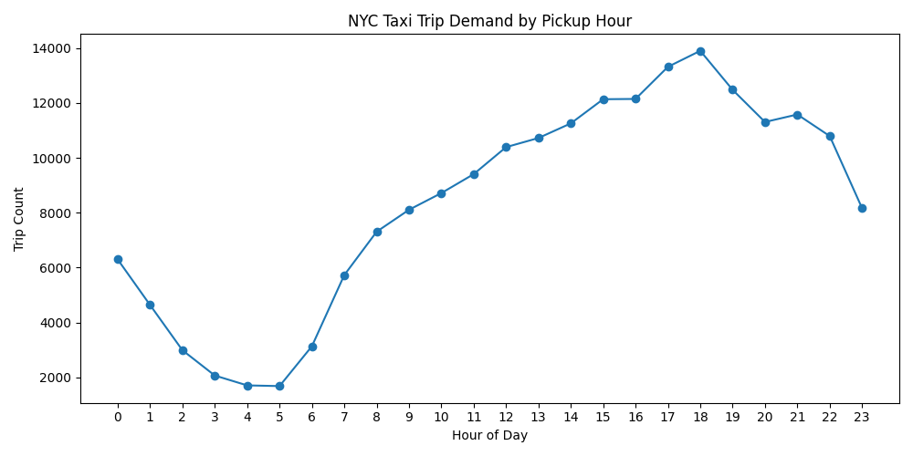
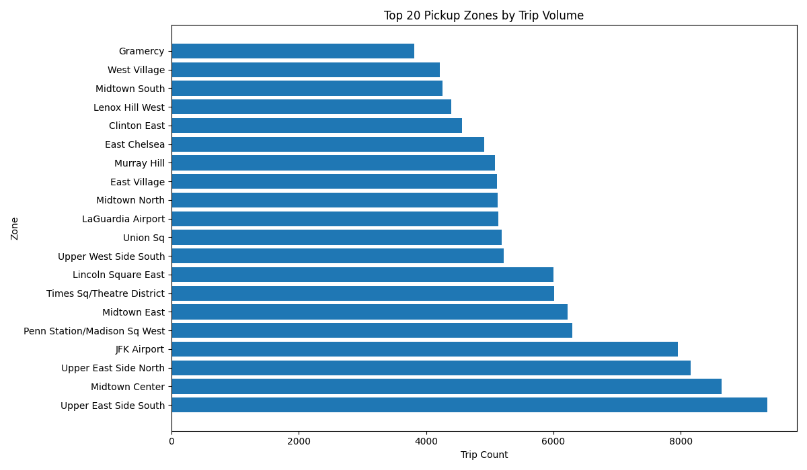

# NYC Taxi Data Analysis


## Project Summary

This project analyzes NYC taxi trip data using PostgreSQL and SQL to identify patterns in taxi demand, fare behavior, and geographic pickup activity.

A sample dataset of **200,000 taxi trips** was processed and loaded into a PostgreSQL database. Analytical SQL queries were used to explore trends such as peak demand hours, busiest pickup locations, and differences in trip distance and fare patterns across boroughs.

The results were exported and visualized using Python to communicate key insights from the data.

## Skills Demonstrated

- SQL data analysis
- PostgreSQL database design
- Data cleaning and preparation with Python
- Analytical queries using joins, aggregations, and window functions
- Data visualization with Python (matplotlib)
- Working with large public datasets

## Tools Used

- PostgreSQL
- SQL
- Python (pandas, matplotlib)
- Git / GitHub

## Project Workflow

1. Raw taxi trip data downloaded from the NYC TLC dataset.
2. Data converted from Parquet to CSV using Python.
3. A sample of 200,000 trips loaded into PostgreSQL.
4. SQL queries used to analyze trip demand and fare patterns.
5. Python used to generate visualizations of key results.

## Visualizations

### Taxi Demand by Hour



Taxi demand increases steadily throughout the day and peaks during evening commute hours around 6 PM.

### Top Pickup Zones



Most taxi pickups occur in Manhattan, particularly in busy areas such as Midtown and the Upper East Side.

## Example SQL Query

The project uses analytical SQL queries to explore taxi trip patterns.

Example: **Busiest Pickup Zones**

```sql
SELECT
    z.zone,
    z.borough,
    COUNT(*) AS trip_count
FROM taxi_trips t
JOIN taxi_zones z
    ON t.pulocationid = z.locationid
GROUP BY z.zone, z.borough
ORDER BY trip_count DESC
LIMIT 10;

```
## Key Insights

- Manhattan accounts for the majority of taxi trips in the dataset.
- Airport-related zones in Queens show higher average fares.
- Taxi demand peaks during evening commute hours.
- Late-night trips tend to have longer travel distances.

## Data Dictionary

| Column | Description |
|------|-------------|
| tpep_pickup_datetime | Timestamp when the trip started |
| tpep_dropoff_datetime | Timestamp when the trip ended |
| passenger_count | Number of passengers in the taxi |
| trip_distance | Trip distance in miles |
| fare_amount | Base fare charged for the trip |
| tip_amount | Tip paid by the passenger |
| total_amount | Total amount paid for the trip |
| PULocationID | Pickup taxi zone ID |
| DOLocationID | Dropoff taxi zone ID |
| payment_type | Payment method used |

## Dataset

The dataset used in this project comes from the NYC Taxi & Limousine Commission.

Source:
https://www.nyc.gov/site/tlc/about/tlc-trip-record-data.page

The raw dataset is distributed in Parquet format and contains detailed taxi trip records including pickup times, locations, trip distance, and fare information.

## Data Preparation

The raw NYC taxi dataset is distributed in **Parquet format**, which is efficient for large-scale data storage but not directly convenient for database ingestion.

The following preparation steps were performed:

1. The Parquet dataset was loaded using **Python (pandas + pyarrow)**.
2. A **200,000 row sample** was extracted to create a manageable analysis dataset.
3. The sample dataset was exported to **CSV format**.
4. The CSV file was imported into a **PostgreSQL database** using the `\copy` command.
5. A relational schema was defined to store taxi trips and taxi zone metadata.

## Repository Structure

nyc-taxi-analysis
│
├── notebooks
│ convert_sample.py
│ create_visualizations.py
│
├── sql
│ 00_create_tables.sql
│ 01_trip_analysis.sql
│ 02_fare_analysis.sql
│ 03_hourly_demand.sql
│ 04_top_zones_by_borough.sql
│ 05_distance_fare_by_hour.sql
│
├── data
│ outputs
│ hourly_demand.csv
│ top_zones.csv
│
└── images
hourly_demand.png
top_zones.png


